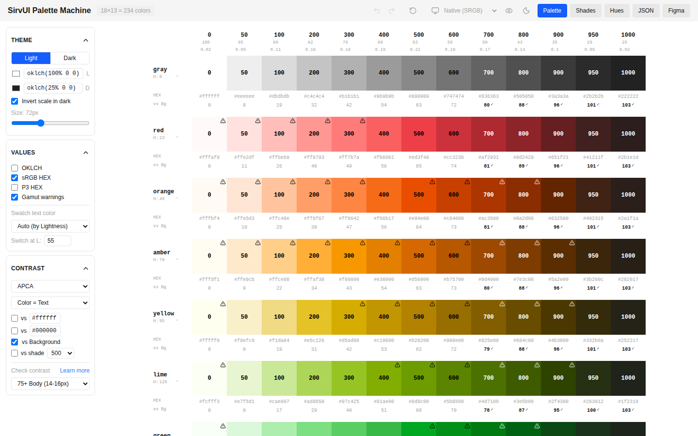

# SirvUI Palette Machine

An OKLCH color palette generator for design systems. Define a lightness/chroma scale once, apply it to any number of hues, check contrast with APCA or WCAG, and export the result to CSS, Tailwind, SCSS, JSON or Figma Variables.



## Why OKLCH

In HSL, `hsl(60 100% 50%)` (yellow) and `hsl(240 100% 50%)` (blue) have the same "lightness" but look nothing alike. OKLCH is designed to be perceptually uniform: colors with the same `L` look about equally light, whatever the hue. A palette built from one shared lightness scale therefore behaves predictably. `blue-500` and `red-500` have similar contrast against the same background, so swapping a brand color doesn't break accessibility.

## Features

- **One scale, many hues.** Each shade (`0`–`1000`) defines lightness `L` and chroma `C`. Each hue defines an angle `H`. Hues can also be marked as neutral gray (zero chroma).
- **Gamut awareness.** The preview works in sRGB or Display P3 (auto-detected). Colors that fall outside the gamut and get clipped are flagged.
- **Contrast checking.** Compare against white, black, the background, or any shade of the same hue:
  - APCA Lc, using the reference APCA-W3 algorithm (0.0.98G-4g), with thresholds for fluent, body, large and spot text.
  - WCAG 2.x ratio, with AA and AAA thresholds.
- **Light and dark themes.** Custom background colors. The scale can optionally invert in dark mode, so `500` stays in the middle and `0` always means "closest to the background".
- **Exports:**
  - JSON (sRGB hex, P3 hex or OKLCH)
  - CSS custom properties
  - Tailwind v4 `@theme` and Tailwind v3 config
  - SCSS variables
- **Figma Variables export.** Generates a primitive palette collection plus light/dark semantic collections: intents (primary, danger…), ground elevations, on-colors, stark and alpha variants, with CSS code syntax. If you upload previously exported files, variable IDs are kept, so updating the tokens doesn't break existing bindings in Figma.
- **Workflow.** Undo/redo (⌘Z / ⌘⇧Z), autosave to `localStorage`, and JSON import/export of the whole configuration.

## Getting started

Requires Node.js 20.19+ or 22.12+.

```bash
npm install
npm run dev      # start the dev server
npm test         # run unit tests (Vitest)
npm run lint     # ESLint
npm run build    # production build into dist/
```

## How it works

A palette color is `oklch(L C H)`, where `L` and `C` come from the shade and `H` comes from the hue. Each color is converted to linear sRGB with Björn Ottosson's OKLab matrices, then to Display P3 by a linear-RGB matrix. Its gamut is checked, and it is clipped for hex output. Contrast is computed on the resulting sRGB values.

```
src/
├── utils/          # pure logic, covered by unit tests
│   ├── colorConversions.js   # OKLCH ↔ sRGB / P3, parsing
│   ├── contrast.js           # APCA and WCAG
│   ├── paletteGenerator.js   # hues × stops → colors
│   └── config.js             # config validation + persistence
├── lib/
│   ├── exportGenerators.js   # CSS / Tailwind / SCSS / JSON
│   └── figmaExport.js        # Figma Variables JSON
├── hooks/          # state: palette, theme, contrast, history, Figma options
├── context/        # PaletteProvider wires the hooks together
└── components/     # tabs: Palette, Shades, Hues, JSON, Figma
```

## Built with

React 19 · Vite · Tailwind CSS 4 · Vitest · lucide-react
